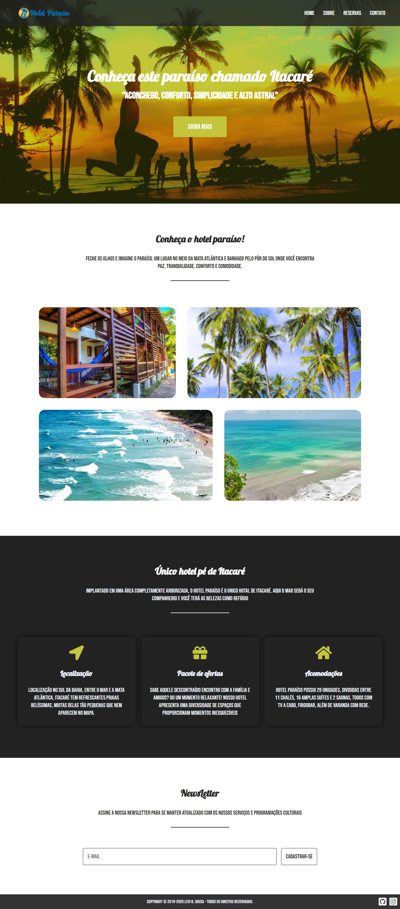

<h1 align="center">"Hotel Paraíso"</h1>

<h2 align="center">About 📖</h2>
   
   <p align="center">
      The "Hotel Paraíso", developed during the first year of the IT course.
      
      Created to put into practice the knowledge acquired in class during the discipline of HTML and CSS. 🙂 <br>
      
   </p>

---

<h2 align="center">Preview 💻</h2>

   <p align="center">
      
   </p>


---

<h2 align="center">Technologies 🚀</h2>

- [CSS](https://developer.mozilla.org/pt-BR/docs/Web/CSS)
- [HTML](https://html.com/)

---

<h2 align="center">How to Contribute 💪</h2>

   ```
   - Fork the project 

   - Create a new branch with your changes:
   $ git checkout -b my-feature

   - Save your changes and create a commit message telling you what you did:
   $ git commit -m "feature: My new feature"

   - Submit your changes:
   $ git push origin my-feature
   ```

   ---

   >Developed by **[@Levi Nunes de Sousa](https://www.linkedin.com/in/levinsousa/)**, with the instructor **[@Ana Lea](https://www.instagram.com/prof_analea/)**. <br> 